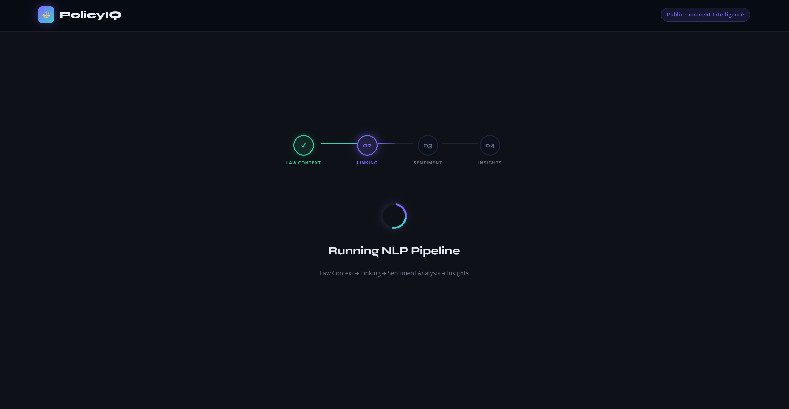
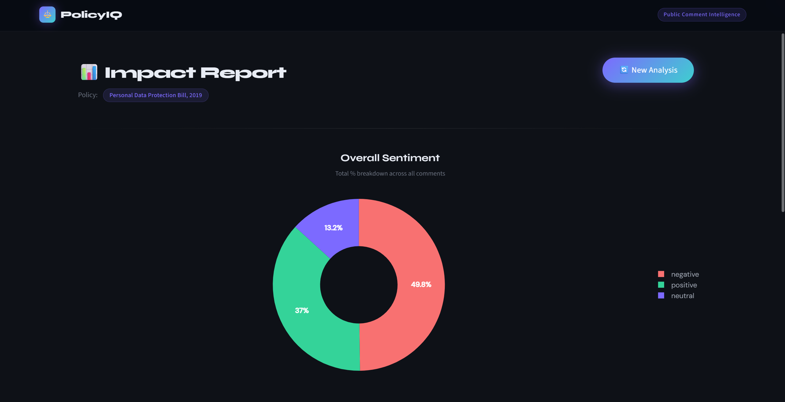
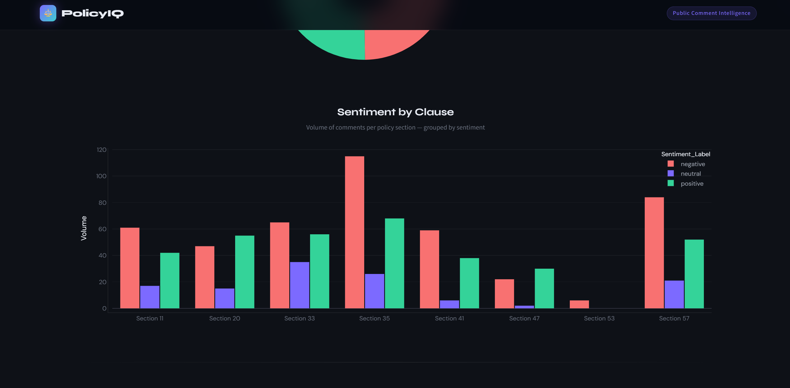
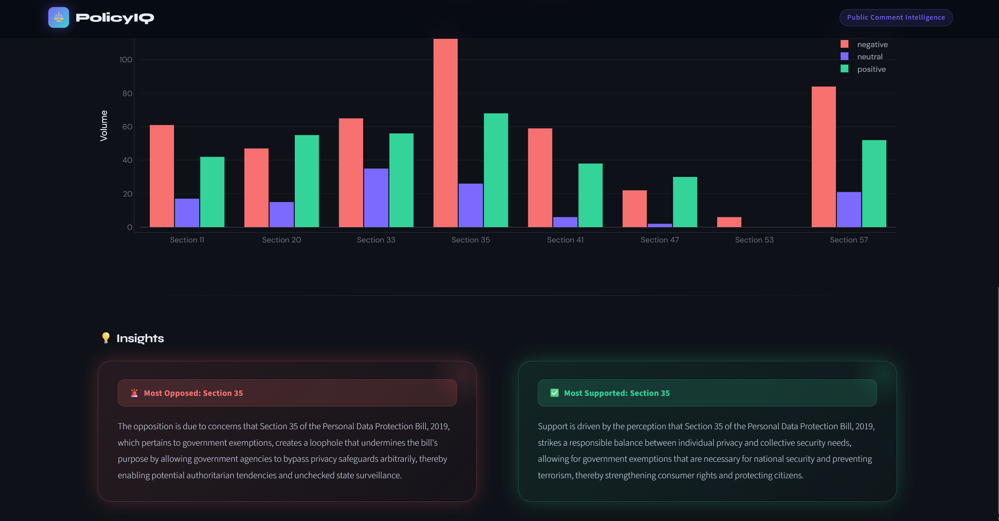

# ⚖️ PolicyIQ: AI-Powered Public Sentiment Intelligence


PolicyIQ is an enterprise-grade NLP dashboard designed to ingest raw public comments on government policies, dynamically link them to specific legal clauses, and synthesize actionable executive insights using state-of-the-art Machine Learning models.

---

## 📸 Dashboard Preview

### 1. The Input Interface
*(Upload a screenshot of the clean, dark-mode landing page here)*


### 2. Dynamic NLP Pipeline
*(Upload a screenshot of the spinning loader and 01->04 progress tracker)*


### 3. Impact Report & LLM Insights

**Overall Public Signal (Pie Chart)**
*(Visualizes total percentage breakdown across positive, negative, and neutral sentiments.)*


**Clause-by-Clause Analysis (Bar Graph)**
*(Breaks down comment volume per specific policy section grouped by sentiment.)*


**AI-Generated Synthesis (Executive Insights)**
*(Llama-3 generated human-readable summaries highlighting key areas of support and concern.)*

## 🧠 The AI Pipeline Architecture

This application relies on a robust, 4-step backend machine learning pipeline that executes sequentially:

1. **Law Context Fetching (`Groq Llama-3`)**: 
   Fetches and structures the core summary of the target policy/law to understand its foundational clauses.
2. **Semantic Linking (`MiniLM`)**: 
   Utilizes `sentence-transformers` to generate dense vector embeddings of public comments, executing high-speed matrix multiplication to map each comment to the most relevant legal section.
3. **Sentiment Engine (`RoBERTa`)**: 
   Passes the linked comments through a fine-tuned HuggingFace Transformer model to classify public reception into `Positive`, `Negative`, or `Neutral` signals.
4. **Insight Generation (`Groq LLM`)**: 
   Identifies the most opposed and supported clauses, feeding the raw comment data back to an LLM to synthesize human-readable executive insights.

---

## 🎨 UI/UX Features
* **Glassmorphism Design:** Custom CSS featuring frosted glass cards, animated gradient meshes, and a deep dark-mode palette.
* **Dynamic State Management:** Seamless transition between input, processing, and visualization states using Streamlit's `st.session_state`.
* **Interactive Visualizations:** Fully customized, responsive Plotly charts with zero layout collisions.

---

## 🛠️ Tech Stack

* **Frontend:** Streamlit, Custom HTML/CSS
* **Visualizations:** Plotly Express & Graph Objects
* **Machine Learning:** PyTorch, HuggingFace Transformers (`roberta-base`), Sentence-Transformers (`all-MiniLM-L6-v2`)
* **LLM Integration:** Groq API (`Llama-3`)
* **Data Processing:** Pandas, NumPy, SciPy

---

## 🚀 Local Installation & Setup

### Prerequisites
* Python 3.10+
* A [Groq API Key](https://console.groq.com/keys)

### 1. Clone the repository
```bash
git clone [https://github.com/yourusername/PolicyIQ.git](https://github.com/yourusername/PolicyIQ.git)
cd PolicyIQ